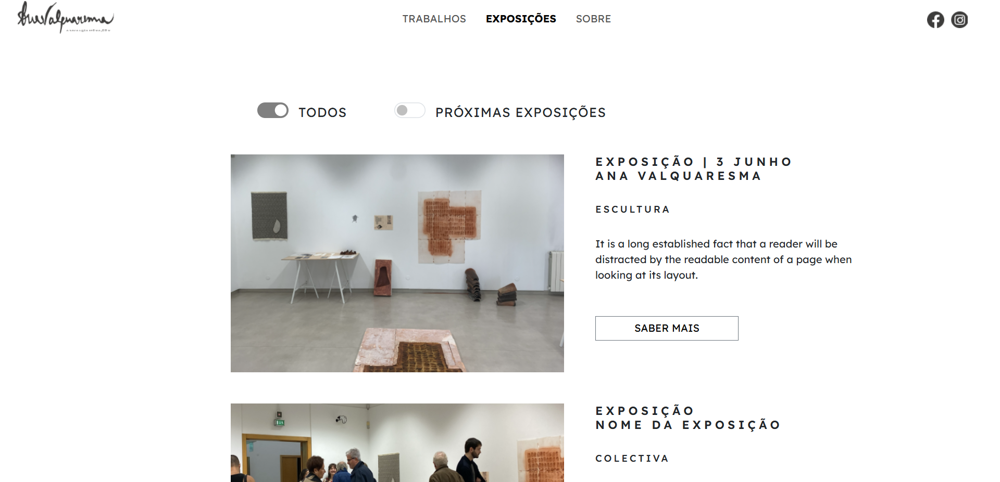
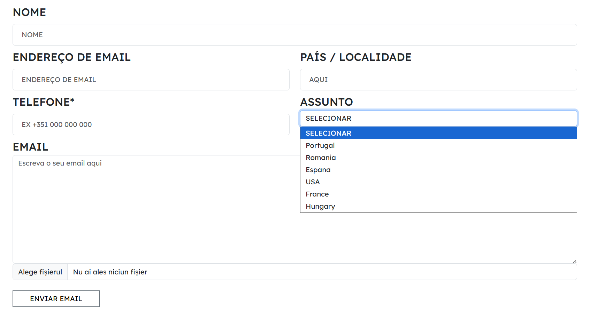

# Erasmus-Project
Personal web project featuring a responsive website for a Portuguese artist, built from scratch. Developed using HTML and CSS, demonstrating clean design principles and a solid understanding of UI/UX fundamentals.

The site consists of five pages showcasing the artist's creations, works, and exhibitions: TRABALHOS, EXPOSIÇÕES, SOBRE, CURRICULUM, and CONTACTOS, the last two are located in the footer.

## **Site Structure**

### **Navigation & Footer**

- **Interactive Navbar:** Includes the artist’s logo (linked to home.html), main navigation links, and social media integration (Facebook & Instagram icons).

- **Sticky Footer**: A dedicated 'div id="footer-links"' containing quick access to Curriculum and Contact, external company links, and copyright notices.

### **Page Breakdown**

- **TRABALHOS (Works):** Features 12 artistic works organized in a 3-column grid. Each item is contained in an individual div with images, descriptions, and "SABER MAIS"(Learn More) buttons. Integrated Bootstrap libraries for enhanced button styling.

- **EXPOSIÇÕES (Exhibitions):** Displays 4 major exhibitions using structured div containers for titles, details, and call-to-action buttons.

- **SOBRE (About):** An introductory page providing background on the artist, including a direct bridge to the contact section.

- **CONTACTOS (Contact):** A comprehensive form using semantic label tags. It includes input fields for name, email, country, and phone, plus a file upload feature. Accessible via the footer or the "ENTRAR EM CONTACTO" (Get in Touch) button.

- **CURRICULUM (CV):** A detailed professional profile featuring personal info, education, and awards presented in a chronological layout.

### Screenshots
#### Works Gallery & Contact Form

  
  

